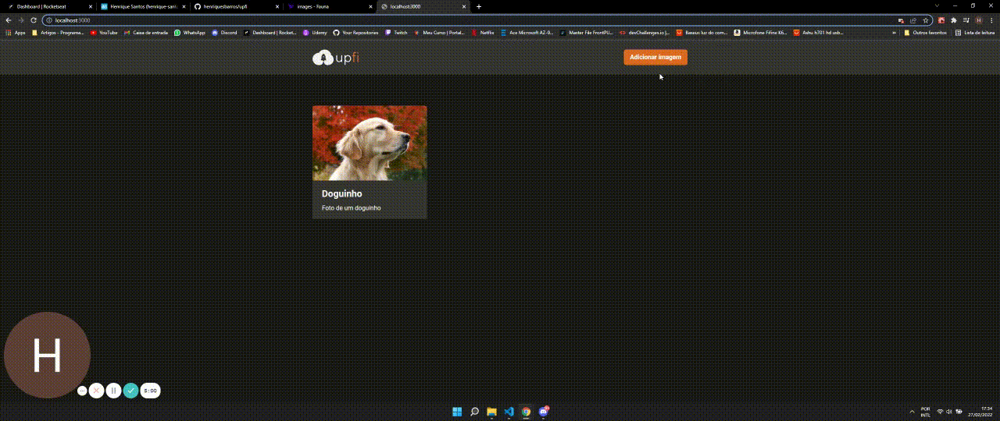

# upfi

    

 

# Dependências

- [ReactJS](https://pt-br.reactjs.org/docs/getting-started.html)
- [NextJS](https://nextjs.org/docs/getting-started)
- [ReactQuery](https://react-query.tanstack.com/overview)
- [React Hook Form](https://react-hook-form.com/get-started)
- [ChakraUI](https://chakra-ui.com/docs/getting-started)
- [Axios](https://axios-http.com/docs/intro)
- [FaunaDB](https://docs.fauna.com/fauna/current/)
- [ImgBB](https://pt-br.imgbb.com/)

# Dependências de desenvolvimento

- [Typescript](https://www.typescriptlang.org/docs/handbook/typescript-in-5-minutes.html)
- [ESlint](https://eslint.org/docs/user-guide/getting-started)
